# EKS Golden Platform

Production-grade Amazon EKS platform built to the 2026 golden standard, delivered entirely via
Infrastructure-as-Code and GitOps — with a documented cheap teardown/spin-up lifecycle so it costs
~$0 when idle.

**Stack:** EKS · Helm · ArgoCD · Prometheus · Grafana · Loki · OpenTelemetry · Karpenter



---

## Architectural spine

> **Terraform owns the disposable cluster; Git owns everything running on it.**

1. **Terraform** provisions the platform (VPC, EKS 1.33, Karpenter, Pod Identity roles, managed
   add-ons) and installs exactly one application-layer thing: **ArgoCD**, plus a root app-of-apps
   manifest.
2. **ArgoCD** then reconciles the *entire* workload layer from this Git repo — the AWS Load
   Balancer Controller, External Secrets Operator, and the full observability stack — using
   pinned upstream Helm charts and sync-wave ordering.
3. Tear the cluster down with `make down` and the platform disappears (~$0). `make up` rebuilds it
   and ArgoCD restores the whole stack from Git. State (S3) and logs (Loki→S3) survive.

Design rationale and every version/decision is documented in [`docs/research/`](docs/research/RESEARCH.md).

---

## Repository layout

```
eks-golden-platform/
├── Makefile                    # make up / down / status / argocd-ui
├── terraform/                  # PLATFORM layer (disposable cluster)
│   ├── versions.tf             # provider pins (>= at current major, uniform)
│   ├── variables.tf            # cost vs. HA knobs (single_nat, endpoint access)
│   ├── main.tf                 # VPC + EKS + Karpenter IAM + managed add-ons
│   ├── argocd.tf               # ArgoCD bootstrap + root app-of-apps
│   ├── iam-pod-identity.tf     # Pod Identity roles (ALB ctrl, External Secrets)
│   ├── providers.tf            # aws/helm/kubernetes/kubectl (token exec, no kubeconfig)
│   ├── outputs.tf
│   └── templates/root-app.yaml.tftpl
├── gitops/                     # APPLICATION layer (GitOps, ArgoCD-managed)
│   ├── bootstrap/              # one child Application per component (+ sync waves)
│   └── apps/                   # Helm values + plain manifests per component
└── docs/
    ├── architecture.svg
    └── research/               # golden-standard reference (READ THIS)
        ├── RESEARCH.md         # index + BLUF + cross-file synthesis
        ├── 01-eks-platform.md
        ├── 02-gitops-argocd-helm.md
        └── 03-observability.md
```

---

## Golden-standard decisions (why each choice)

| Layer | Decision | Why |
|-------|----------|-----|
| Cluster IaC | `terraform-aws-modules/eks ~> 21` | community standard; Karpenter + access-entries built in |
| Compute | Karpenter v1.x, spot-first | cheapest steady state; NodePool/EC2NodeClass CRDs |
| Identity | EKS **Pod Identity** | cluster-agnostic; survives teardown/rebuild (IRSA breaks) |
| Cluster auth | **Access Entries API** | no `aws-auth` ConfigMap lockout risk |
| NAT | single NAT gateway | ~$32/mo vs ~$97 per-AZ; one-line flip to HA |
| GitOps | ArgoCD **app-of-apps** | explicit, single-cluster clarity |
| Secrets | External Secrets Op + Pod Identity | **public-repo-safe** — only pointers in Git |
| Metrics | kube-prometheus-stack 87.x | Operator + Prometheus + Grafana + Alertmanager |
| Logs | Loki 3.x SingleBinary → S3 | cheap; logs survive teardown; native OTLP ingest |
| Telemetry | OpenTelemetry Operator + Collector | unified metrics+logs+traces pipeline |

*(This is the only markdown table in the repo — the research docs use ASCII/ranked lists for
messaging-app legibility.)*

---

## Prerequisites

- Terraform >= 1.9, AWS CLI v2, `kubectl`, `helm`
- AWS credentials with permissions to create VPC/EKS/IAM (an admin-ish role)
- An **S3 bucket + DynamoDB lock table** for Terraform remote state
- Two S3 buckets for Loki: `eks-golden-loki-chunks`, `eks-golden-loki-ruler`
- A secret in AWS Secrets Manager at `eks-golden/grafana` with keys `admin-user`, `admin-password`

## Quick start

```bash
# 1. Configure backend + vars
cp terraform/terraform.tfvars.example terraform/terraform.tfvars
#   edit git_repo_url to your fork; create backend.hcl for the S3 backend

# 2. Init + validate
make init
make validate

# 3. Bring the platform up (Terraform, then ArgoCD bootstraps the rest)
make up

# 4. Watch ArgoCD sync the stack
make status
make argocd-ui          # https://localhost:8080
make argocd-password    # initial admin password

# 5. Tear it all down (~$0). S3 state + Loki chunks are retained.
make down
```

## Cost

```
EKS control plane        ~$73/mo   (fixed, per cluster)
Single NAT gateway       ~$32/mo   (+ data processing)
2x t3.medium bootstrap   ~$30/mo   (spot-eligible via Karpenter for workloads)
EBS + S3                 ~$6-20/mo
-----------------------------------
Always-on floor          ~$110-140/mo   ->   make down -> ~$0
```

⚠️ **Keep `kubernetes_version` current.** Falling into EKS *extended support* raises the control
plane to ~$438/mo. See [`docs/research/01-eks-platform.md`](docs/research/01-eks-platform.md) §7.

## Security & public-repo safety

- No secret values in Git — External Secrets Operator commits only *pointers* to AWS Secrets
  Manager, resolved at runtime via Pod Identity.
- `.gitignore` blocks `*.tfstate*`, `*.tfvars`, `kubeconfig*`, `*.pem`, `.env`.
- IMDSv2 required on all nodes (`http_tokens=required`, hop limit 1); KMS-encrypted K8s secrets;
  nodes in private subnets; Access Entries instead of `aws-auth`.

## Production vs. portfolio posture

This repo defaults to a **cost-conscious portfolio** posture. Flip to **production HA** with two
tfvars, no code changes:

```hcl
single_nat_gateway     = false   # one NAT per AZ (full HA)
endpoint_public_access = false   # private API endpoint (reach via SSM/bastion)
```

## License

MIT — see [LICENSE](LICENSE).

---
*Built as a portfolio reference for the 2026 EKS golden standard. Research + decisions in
[`docs/research/`](docs/research/RESEARCH.md).*
