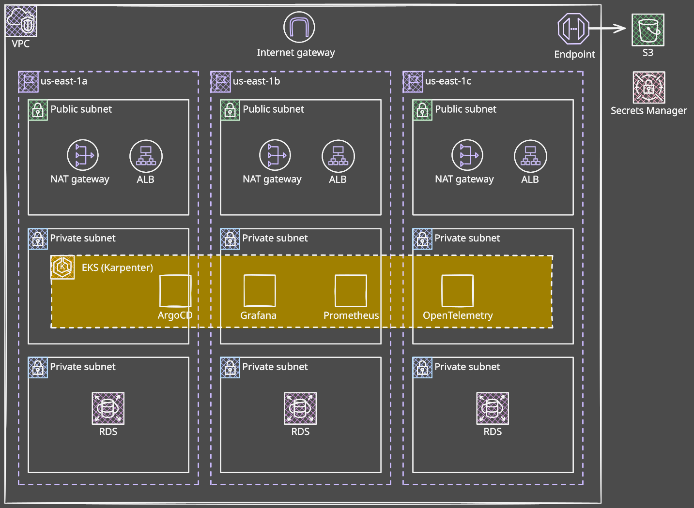

# EKS Golden Platform

Production-grade Amazon EKS platform delivered entirely through **Infrastructure-as-Code** and
**GitOps** — with a documented teardown/rebuild lifecycle, so it costs **~$0 when idle**.

[](https://github.com/c0debyeric/eks-golden-platform/actions/workflows/terraform.yml)
[](https://github.com/c0debyeric/eks-golden-platform/actions/workflows/build-image.yml)
[](LICENSE)




> **Terraform owns the disposable cluster; Git owns everything running on it.**

Terraform provisions the platform and installs exactly one thing on top: **ArgoCD**. ArgoCD then
reconciles the *entire* workload layer from this repo. Tear it all down with `make down` (~$0);
`make up` rebuilds it and ArgoCD restores the stack from Git. State (S3) and telemetry data
(Loki logs + Tempo traces → S3) survive.

## Highlights

- **One-command lifecycle** — `make up` provisions everything; `make down` returns you to ~$0.
- **GitOps-native** — ArgoCD app-of-apps with sync-wave ordering; the whole workload layer is declarative.
- **Full observability** — metrics, logs, and traces via OpenTelemetry → Prometheus, Loki, Tempo. Telemetry survives teardown (S3).
- **Secure by default** — EKS Pod Identity, Access Entries (no `aws-auth`), External Secrets (public-repo-safe — only pointers in Git), IMDSv2, KMS-encrypted secrets, private nodes.
- **Cost-tunable** — flip between production-HA and a cheap demo posture with tfvars only, no code changes.
- **Optional data tier** — RDS PostgreSQL (Multi-AZ primary + read replicas) in an isolated, no-egress subnet tier.
- **Sample workload** — an OpenTelemetry-instrumented [MCP backend](application/backend/README.md) that drops straight into the observability pipeline.
- **Version currency enforced** — Renovate opens pin-bump PRs; a CI contract gate blocks chart bumps that would break at sync time.

## Architecture

1. **Terraform** provisions the platform — VPC with 3-tier subnets, EKS 1.34, Karpenter, Pod
   Identity roles, managed add-ons, and an optional RDS PostgreSQL tier — then bootstraps **ArgoCD**
   plus a root app-of-apps manifest.
2. **ArgoCD** reconciles the workload layer from `gitops/`: AWS Load Balancer Controller,
   External Secrets Operator, cert-manager, and the full observability stack — using pinned
   upstream Helm charts and sync-wave ordering.
3. **`make down`** destroys the cluster (~$0). **`make up`** rebuilds it and ArgoCD restores the
   stack. Persistent state and telemetry live in S3 and survive.

## Stack

**Platform:** Terraform · `terraform-aws-modules/eks` · EKS 1.34 · Karpenter · EKS Pod Identity · Access Entries · RDS PostgreSQL

**GitOps & workloads:** ArgoCD · Helm · AWS Load Balancer Controller · External Secrets Operator · cert-manager

**Observability:** OpenTelemetry (Operator + Collector) · Prometheus · Grafana · Alertmanager · Loki (→ S3) · Tempo (→ S3)

**Sample app:** Node.js 24 · TypeScript · Model Context Protocol SDK · Express 5

## Repository layout

```
eks-golden-platform/
├── Makefile                 # make up / down / status / argocd-ui / rds-info ...
├── renovate.json            # automated pin bumps (terraform + helm + argocd)
├── terraform/               # PLATFORM layer (disposable cluster)
│   ├── network.tf           # VPC + 3-tier subnets (public/private/database)
│   ├── cluster.tf           # EKS control plane + managed add-ons + bootstrap node group
│   ├── compute.tf           # Karpenter AWS side (node IAM role, interruption queue)
│   ├── iam.tf               # Pod Identity roles
│   ├── storage.tf           # Loki + Tempo S3 buckets
│   ├── rds.tf               # optional PostgreSQL (Multi-AZ + read replicas)
│   ├── argocd.tf            # ArgoCD bootstrap + root app-of-apps (the handoff)
│   └── bootstrap/           # ONE-TIME: S3 state bucket + GitHub OIDC CI role
├── gitops/                  # APPLICATION layer (GitOps, ArgoCD-managed)
│   ├── bootstrap/           # one child Application per component (+ sync waves)
│   └── apps/                # Helm values + plain manifests per component
├── application/
│   └── backend/             # OpenTelemetry-instrumented MCP server (TypeScript)
├── scripts/                 # CI gates (e.g. CRD apiVersion contract check)
└── docs/                    # architecture diagram + research/reference
```

## Prerequisites

- Terraform >= 1.15, AWS CLI v2, `kubectl`, `helm`
- AWS credentials able to create VPC / EKS / IAM
- **One-time bootstrap** (`terraform/bootstrap/`, run once with local state) — creates the S3
  state bucket and the GitHub OIDC role for CI. State locking is S3-native (`use_lockfile`), no DynamoDB.
- A secret in AWS Secrets Manager at `eks-golden/grafana` with keys `admin-user` and
  `admin-password` (resolved into the cluster by External Secrets Operator).

## Quick start

```bash
# 1. Configure backend + vars
cp terraform/terraform.tfvars.example terraform/terraform.tfvars
#    edit git_repo_url to your fork; create backend.hcl for the S3 backend

# 2. Init + validate
make init
make validate

# 3. Bring the platform up (Terraform, then ArgoCD bootstraps the rest)
make up

# 4. Watch ArgoCD sync the stack
make status
make argocd-ui          # https://localhost:8080
make argocd-password    # initial admin password

# 5. Tear it all down (~$0); S3 state + telemetry are retained
make down
```

Run `make help` to see all targets.

## Configuration

The platform **defaults to a production-HA posture**. Switch to a cheap demo posture entirely
through `terraform.tfvars` — no code changes:

```hcl
single_nat_gateway     = true    # one shared NAT (~$32/mo) instead of one per AZ
create_rds             = false   # skip the database tier
endpoint_public_access = true    # public API endpoint (set false + SSM/bastion to harden)
```

Set `create_rds = true` to provision PostgreSQL (Multi-AZ primary + 2 read replicas) in the
isolated database subnet tier, which has **no NAT route** — the DB physically cannot egress to the
internet. The master password is generated and stored in Secrets Manager at `eks-golden/rds-master`;
inspect endpoints with `make rds-info`.

## Cost

```
Production floor  ~$200–240/mo   (per-AZ NAT, EKS control plane, bootstrap nodes)
Demo floor        ~$110–140/mo   (single_nat_gateway=true, create_rds=false)
Idle              ~$0            (make down)
```

> **Keep `kubernetes_version` current.** Falling into EKS *extended support* raises the control
> plane from ~$73/mo to ~$438/mo. Upgrade one minor at a time, control plane before charts.
> See [`docs/research/01-eks-platform.md`](docs/research/01-eks-platform.md).

## Sample application — MCP backend

`application/backend/` is a small, production-shaped **[Model Context Protocol](https://modelcontextprotocol.io)**
server (TypeScript, Streamable HTTP, stateless) wired into the platform's OpenTelemetry pipeline —
traces → Tempo, metrics → Prometheus, logs → Loki. ArgoCD deploys it at sync wave 5, after the
observability stack. See [`application/backend/README.md`](application/backend/README.md) for local
dev, configuration, and the image build/deploy flow.

## CI/CD

All workflows are **keyless** — GitHub Actions assumes an AWS role via OIDC ([`docs/OIDC-SETUP.md`](docs/OIDC-SETUP.md)); no static credentials are stored.

- **`terraform`** — `fmt` + `validate` on every PR; a **GitOps contract** gate renders each pinned
  chart against its committed values and asserts every committed CR's `apiVersion` is actually
  served by that chart; a scoped `terraform plan` runs on `main`.
- **`build-image`** — builds and pushes the MCP backend image to ECR (immutable, SHA-tagged) on
  changes under `application/backend/`.

## Documentation

- [`docs/research/RESEARCH.md`](docs/research/RESEARCH.md) — design rationale and every version/decision
- [`docs/NETWORK-ARCHITECTURE.md`](docs/NETWORK-ARCHITECTURE.md) — VPC 3-tier subnet layout
- [`docs/OIDC-SETUP.md`](docs/OIDC-SETUP.md) — keyless GitHub Actions → AWS OIDC
- [`docs/TEARDOWN-GOTCHAS.md`](docs/TEARDOWN-GOTCHAS.md) — teardown & state-lock operational notes

## Security

- No secret values in Git — External Secrets Operator commits only *pointers* to AWS Secrets
  Manager, resolved at runtime via Pod Identity.
- `.gitignore` blocks `*.tfstate*`, `*.tfvars`, `kubeconfig*`, `*.pem`, `.env`.
- IMDSv2 required on all nodes, KMS-encrypted Kubernetes secrets, nodes in private subnets, and
  Access Entries instead of the `aws-auth` ConfigMap.

## License

MIT — see [LICENSE](LICENSE).
